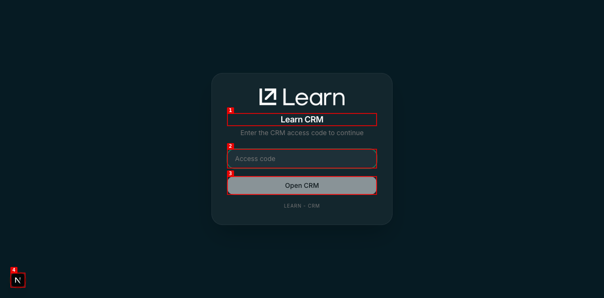

# Dogfood Report: Learn CRM Productization

| Field | Value |
|-------|-------|
| **Date** | 2026-05-18 |
| **App URL** | https://learn.enterlinks.localhost:1355/crm |
| **Session** | learn-crm-productization-iter-1 |
| **Scope** | Contact/company/vector drill-down routes after productization slice |

## Summary

| Severity | Count |
|----------|-------|
| Critical | 0 |
| High | 0 |
| Medium | 0 |
| Low | 0 |
| **Total** | **0** |

Dogfood did not reach the authenticated CRM surface. The browser session landed on
the CRM access-code gate and no access code was provided. Per auth safety, no
credential guessing was attempted.

Evidence:

## Issues

No authenticated product issues recorded.
