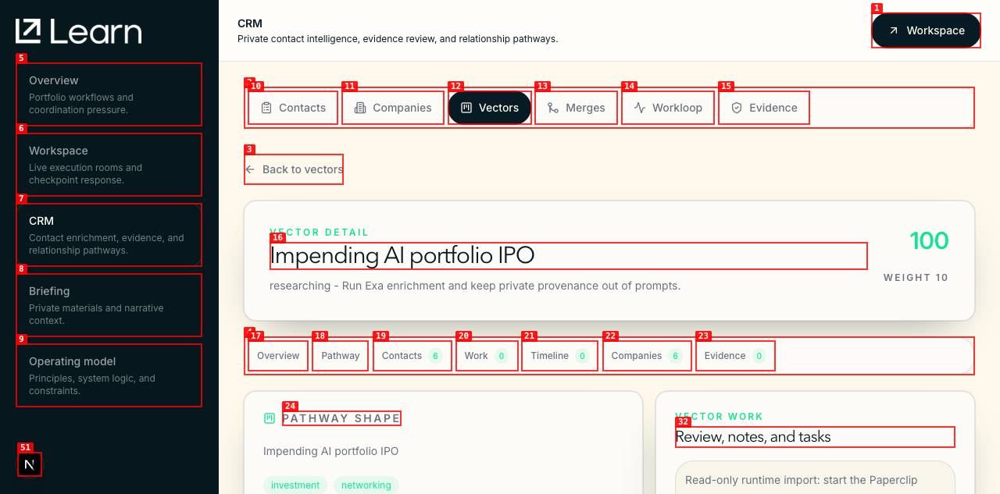
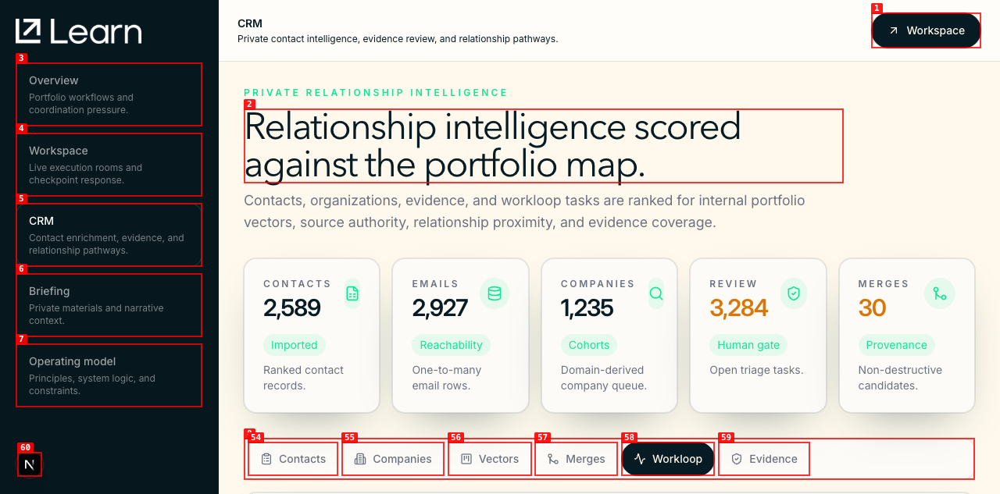
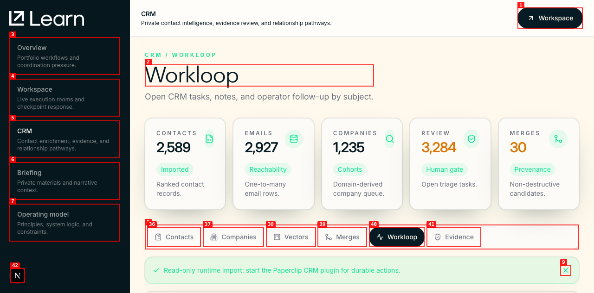
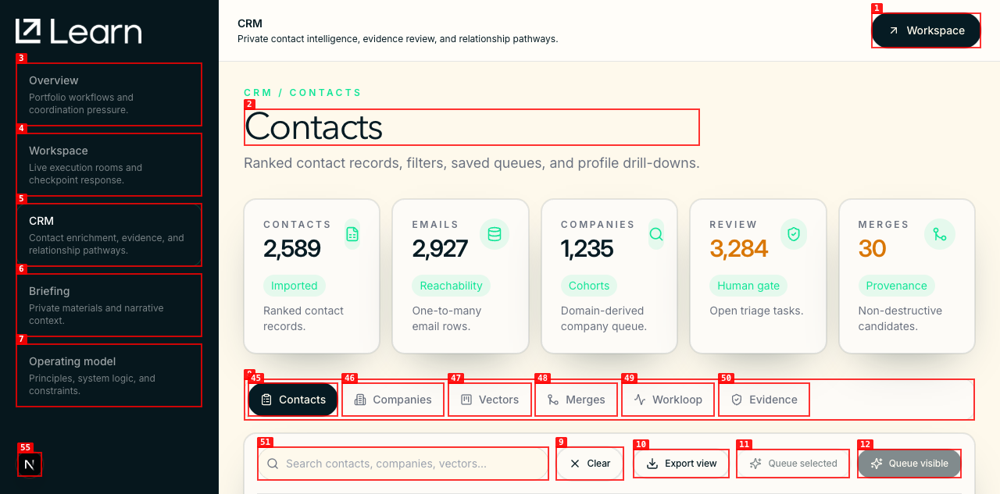

# Dogfood Report: Learn CRM Productization

| Field | Value |
|-------|-------|
| **Date** | 2026-05-18 |
| **App URL** | `https://learn.enterlinks.localhost:1355/crm` |
| **Session** | `learn-crm-auth-cookie` |
| **Scope** | Authenticated CRM overview, contact detail, company detail, vector detail, Workloop, Evidence, contact vCard export |

## Summary

| Severity | Count |
|----------|-------|
| Critical | 0 |
| High | 0 |
| Medium | 2 |
| Low | 0 |
| **Total** | **2** |

Both medium findings were fixed during the run and re-verified with direct `agent-browser`.

Artifacts:

- `screenshots/overview.png`
- `screenshots/contact-detail.png`
- `screenshots/company-detail.png`
- `screenshots/vector-detail.png`
- `screenshots/vector-detail-fixed.png`
- `screenshots/workloop.png`
- `screenshots/workloop-fixed.png`
- `screenshots/contacts-from-workloop-link-fixed.png`
- `screenshots/evidence-fixed.png`
- `david-graziano.vcf`

## Issues

### ISSUE-001: Vector detail included personal email domains as company domains

| Field | Value |
|-------|-------|
| **Severity** | medium |
| **Category** | content / ux |
| **URL** | `https://learn.enterlinks.localhost:1355/crm/vectors/opportunity%3Aai_portfolio_ipo` |
| **Repro Video** | N/A |
| **Status** | Fixed |

**Description**

The vector detail `Company domains` section included personal domains such as `gmail.com` and `hotmail.com`, making the company path look less trustworthy. Expected: company-domain lists should only include organization/company domains.

**Repro Steps**

1. Navigate to the vector detail route.
   

2. Observe personal domains in the company-domain group.

3. Fix applied: `cohortsForOpportunity` now excludes cohorts with `likelyDomainType === "Personal"`.
   

---

### ISSUE-002: Workloop route opened with generic CRM identity and contact queue controls

| Field | Value |
|-------|-------|
| **Severity** | medium |
| **Category** | ux |
| **URL** | `https://learn.enterlinks.localhost:1355/crm/workloop` |
| **Repro Video** | N/A |
| **Status** | Fixed |

**Description**

The Workloop route still presented the generic CRM page header and the contact search/filter/saved-queue toolbar. Expected: `/crm/workloop` should identify itself as Workloop and show task work first, while contact queue controls stay on `/crm/contacts`.

**Repro Steps**

1. Navigate to Workloop.
   

2. Observe generic route copy and contact queue controls competing with task work.

3. Fix applied: section routes now use route-specific headers, CRM sub-nav uses route links, and `CrmCommandCenter` only renders for Contacts.
   

4. Follow the Contacts sub-nav link and verify the contact queue toolbar still appears on Contacts.
   

---

## Non-Issue Checks

- Contact detail loaded and exported a vCard without private notes.
- Company detail loaded from the contact related-record link after scrolling the link into view.
- Evidence route loaded with route-specific identity and no contact queue toolbar.
- No browser errors were reported; console output was limited to development Fast Refresh, Vercel Analytics debug logs, and a Next.js smooth-scroll warning.
